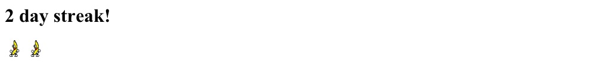

# One Hundred Days Of Code 2022

A self-issued challenge to write a small program every day for one hundred days.

---

| Day    | Goal                                                    | Result     | Language    |
|--------|---------------------------------------------------------|------------|-------------|
| 1      | OpenCV eye deteciton false positive reduction           | Completed  | Python      |
| 2      | Tweepy Oauth2 flow helper                               | Completed  | Python      |
| 3      | File joiner                                             | Completed  | Go          |
| 4      | DTMF generator                                          | Completed  | Python      |
| 5      | Morse Code quizzer                                      | Completed  | Python      |
| 6      | Streak Image generator                                  | Completed  | Python      |
| 7      | "hello world" of Rust and Cargo                         | Completed  | Rust        |
| 8      | Git commit hooks to auto generate "N day streak!" image | Completed  | Shell script |
| 9      | Tonelli Shanks algorithm                                | Unfinished | Rust        |
| 🎉10🎉 | Apple itunes podcast recommendation scraper             | Completed  | Python      |
| 11     | Markdown lexer and parser                               | Partial    | Python      | 
| 12     | Hello World in arm assembly                             | Completed  | arm64       |
| 13     | Streak image generator and git hook redo                | Completed  | Python/shell |
| 14     | Rust primitives                                         | Completed  | Rust        | 
| 15     | Machine learning based dog detector                     | Completed  | Python      | 
| 16     | Go web framework tinkering                              | Partial    | Go          |
| 17     | ImageNet manifest organizer                             | Partial    | Python      |
| 18     | ImageNet manifest organizer                             | Partial    | Python      |
| 19     | ImageNet manifest organizer                             | Partial    | Python      |
| 20     | ImageNet manifest organizer                             | Partial    | Python      |
| 21     | GZip file reader                                        | Completed  | Go          |
| 22     | RSA Signature generator for file                        | Completed  | Go          |
| 23     | GZip file header manipulation                           | Completed  | Go          |
| 24     | RIPE Atlas DNS API client                               | Completed  | Python      |
| 25     | World (globe) visualization                             | Partial    | Python      |
| 26     | Ping geo distance calculator                            | Partial    | Python      |
| 27     | PicoCTF challenge                                       | Completed  | misc        |
| 28     | GoBGP peering running                                   | Completed  | Go          |
| 29     | Python client for GoBPG via GoRPC                       | Completed  | Python/Go   |
| 30     | Linux rebuild                                           | Completed  | misc        |
| 31     | GameMaker Studio "Fire Jump" day 1                      | Completed  | GameMaker   |
| 32     | Playing with TikTok text-to-speach                      | Completed  | misc        |
| 33     | GameMaker Studio "Fire Jump" day 2                      | Completed  | GameMaker   |
| 34     | Implementing GiftWrapping algorithm                     | Completed  ||
| 35     ||||
| 36     ||||
| 37     ||||
| 38     ||||
| 39     ||||
| 40     ||||
| 41     ||||
| 42     ||||
| 43     ||||
| 44     ||||
| 45     ||||
| 46     ||||
| 47     ||||
| 48     ||||
| 49     ||||
| 50     ||||
| 51     ||||
| 52     ||||

