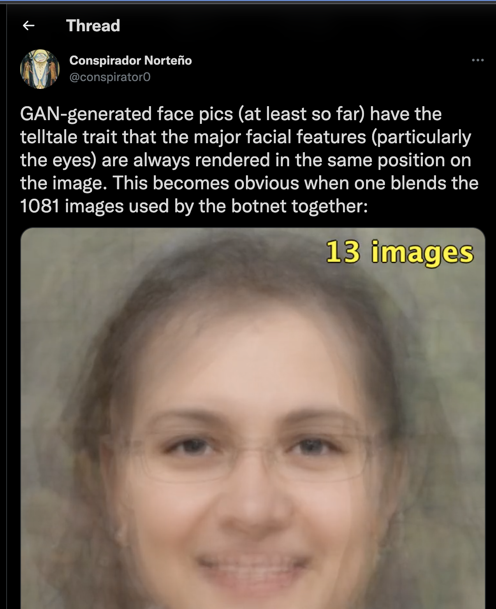

# Eye detection on face images generated by a GAN

---
```
Language: Python
Brief: OpenCV eye deteciton false positive reduction
Scope: experiment
Tags: computer vision, bot detection, twitter
State: finished
Result: reasonable success
```
---
The dis-information researcher who goes by @conspirator0 on Twitter has posted about detecting sock puppet/bot Twitter accounts by identifying profile pictures that are from a GAN. Specifically that eye placement is a tell-tail sign of GAN image.



[Link to Tweet](https://twitter.com/conspirator0/status/1457051603773575168)

I wanted to see if computer vision eye detection would easily "witness marks" of a GAN.

My first pass as using OpenCV showed the eye detection of Haar Cascades generated false positives.


`Day 1 code` is to intended to reduce false positives by filtering unlikely eye candidates.


### Results 


Filtered out false positives with a few passes 
- Any eye rectangles that overlapped with other eye rectanges
- Any eye rectangles that doesn't have exactly one other eye rectangle on the same horizontal plane
- Picked eye rectangle pairs that is the closest to the vertical mid point of the face image

Worked reasonably well. Code is a bit clunky. Nothing leaps out at my ultimate to see if GAN images can be detected with eye placement.
