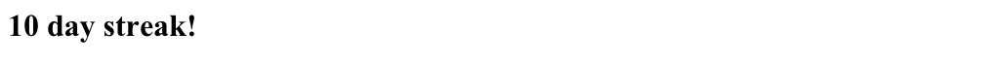
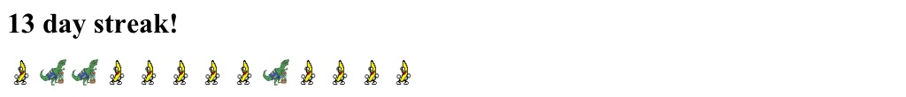

# Streak pre/post commit scripts (revisit)

---
```
Language: Python/bash
Brief: Generate a image for the commit streak in days and add it to the git repository
Scope: 
Tags: revisit, git
State: 
Result: 
```
---

The [day_6](../day_6/) and [day_8](../day_8) are kind of broken and it's annoying me. The image generation is only counting up to 10 days for some reason. The pre/post commit scripts are hacky and sometimes don't work. Redoing both days projects as a combined new project.

The goal is to for automatically create a image that shows the number of uninterrupted days I've added to this repository and update the repository with that image

Example image from day_6 project


### Results

Much better. 

The 10-day streak limit was a bug in my day_6 script. There was an actual gap because the git timestamps were in UTC, not
local time. So when I had commited a bit later in the evening the UTC had already rolled over. 

Also there was a bug that would count the oldest streak as the most recent. Commits are returned from newest to oldest in the git module
I was using. I just reversed the list.

The commit hook scripts are still not great but I used a better method to work around 'post-commit' always being run, even if --no-verify was
passed to commit command.

Lastly I added little characters, one for each day in the streak to the image. It's dumb in a way i like.

---

### If I was to do more
---

- add more dumb 'pip' characters to my streak image.
- make the post/pre hook scripts better


### Notes

First time in the _100 days_ I am returning to a previous day's program. I'm not totally OK with it because I don't want to keep returning 
to older stuff. Part of the challenge is to be able to mentally move on from something I'm not satisfied with. 

I'm giving myself a pass on this because the result is supposed to be applied to all the upcoming days. To make the next days a little better.
So fixing something that would have annoyed me every day forward is worth going back.

---

### Example 



---