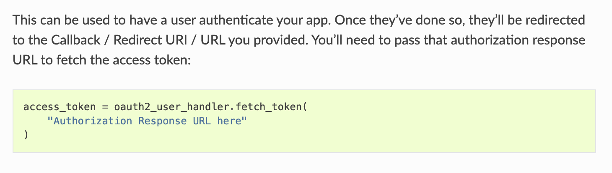
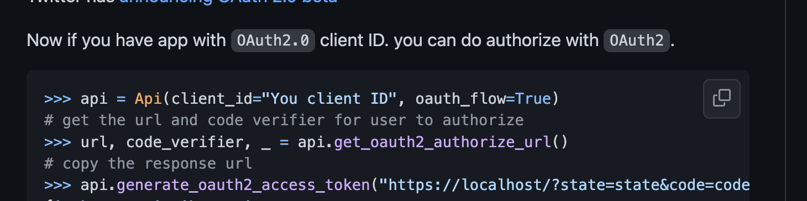

# OAuth2 helper for tweepy 

---
```
Language: Python
Brief: OAuth2 helper for Tweepy 
Scope: port
Tags: twitter
State: finished
Result: reasonable success
```
---

One of the common questions on the [Twitter developer forum](https://twittercommunity.com/) is how to get OAuth2 to work. Documentation I have seen 
does not capture well the passing of state from a project to Twitter and then back to the project very well. Specifically a lot 
of the Python Twitter API module documentation has some varient of "pass that authorization response URL to fetch the access token" in the stage where
Twitter returns control back to the script


[Tweepy documentation snippit](https://docs.tweepy.org/en/latest/authentication.html#oauth-2-0-authorization-code-flow-with-pkce-user-context)

Getting the response is kind of hand waved away. This is the same in the [pytwitter-2 documentation](https://github.com/sns-sdks/python-twitter).


🤷‍♂️"Copy the response URL"

I wrote a helper for pytwitter-2. This is a port of the same idea to tweepy. In the dev forum tweepy seems to be used more commonly as a Python module 
for API access.

This basically a port of the [wrapper for pytwitter](https://gist.github.com/rdpickard/ec91025a0c9870931debeb224bc7dfc8)

### Results 

Worked OK. Some things in the [tweepy auth documentation](https://docs.tweepy.org/en/latest/authentication.html#oauth-2-0-authorization-code-flow-with-pkce-user-context
) that don't jive with what I ended up having to do to get an authenticated Client, version 2 of the API, instance.

##### Consumer key
If I don't pass `user_auth=False` to the Client.get_me() the tweepy auth.py throws a TypeError.

```
TypeError: Consumer key must be string or bytes, not NoneType
```

The get_me funciton defaults user_auth to True for some reason I can't understand

##### Passing bearer token

The tweepy documentation for passing access token to Client creation is basically

```
access_token = oauth2_user_handler.fetch_token(
    "Authorization Response URL here"
)

client = tweepy.Client("Access Token here")
```

but that doesn't work. The return value of fetch_token is a dictionary. Doing this way will throw an exception

```
tweepy.errors.Forbidden: 403 Forbidden
```

The right way to do it is

```
access_credentials_dictionary = oauth2_user_handler.fetch_token(auth_response_path))
client = tweepy.Client(bearer_token=access_credentials_dictionary["access_token"])
```

### If I was to do more
- Make a wrapper class to put all of the OAuth flow logic into
- Write function to automatically refresh expired token
