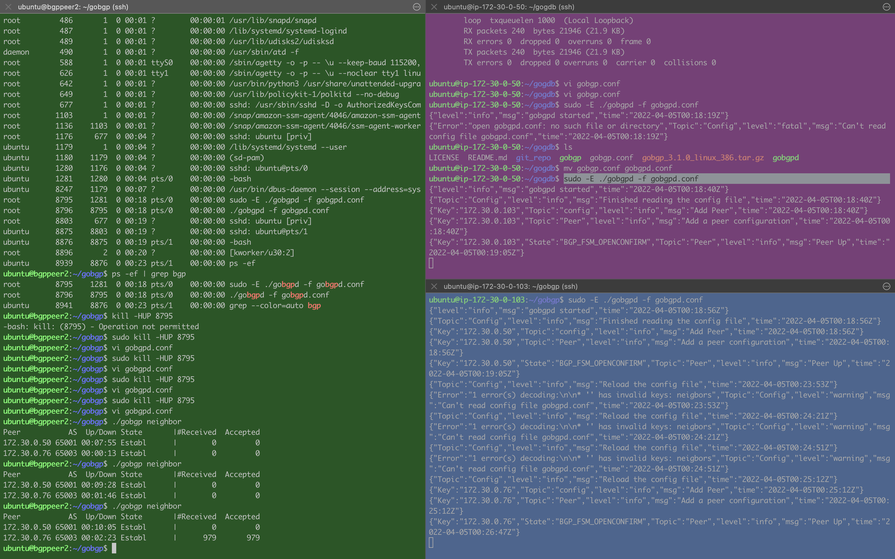
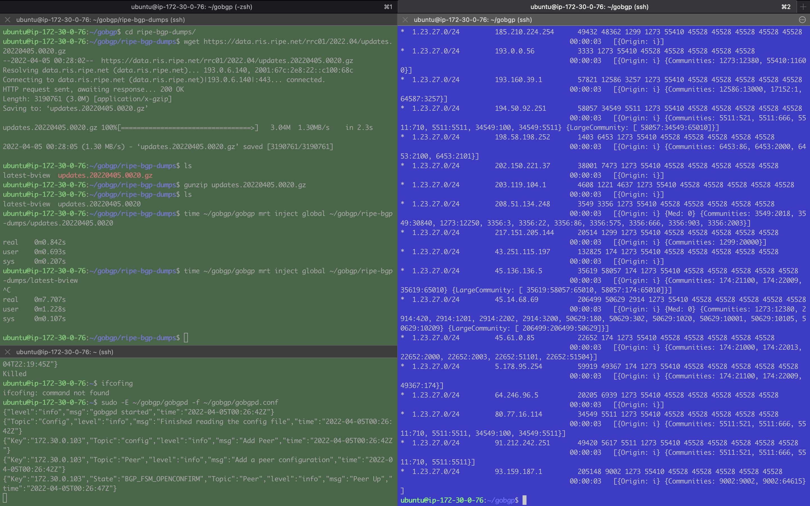

# GoBGP peering 

---
```
Language: Go / linux
Brief: Get a small BGP peering network with the gobgp implementation
Scope: 
Tags: 
State: 
Result: 
```
---

I want to be able to do some experimenting with BGP so I need a network of BGP peers to talk to.

There is a [Go implementation of BGP](https://github.com/osrg/gobgp/) that looks interesting. 

Try to get it working in AWS

### Results

---

A success. For the most part things just worked



Important bit is on the bottom-left; showing three BGP neighbors peering and one sending out routes.

I could not get the [entire rrc00.ripe rib dump](https://www.ripe.net/analyse/internet-measurements/routing-information-service-ris/ris-raw-data) to load into an 
instance on AWS. I suspect it is a memory issue. I only tried up to a t2.medium. However I can get a partial load and it works great. as a
way to introduce real routes in to the peering network.

### If I was to do more

---

Maybe see how large of an AWS EC2 instance it will take to load the whole rrcc00 rib.

Want to do more tinkering with the GoBGP tools, like flowspec and RPKI.

I also want to experiment with the gRPC programming interface.

### Notes

---

created ubuntu EC2 micro instance w/ 12G disk

SSH into instance

package updates and installs:
sudo apt-get update
sudo apt install golang-go
sudo apt-get install python-is-python3
sudo apt-get install python3-pip
sudo python -m pip install grpcio
python -m pip install grpcio-tools
sudo apt install net-tools

mkdir -p gobgp/git_repo
cd gobgp/git_repo
git clone https://github.com/osrg/gobgp

wget https://github.com/osrg/gobgp/releases/download/v3.1.0/gobgp_3.1.0_linux_386.tar.gz

time ~/gobgp/gobgp mrt inject global ~/gobgp/ripe-bgp-dumps/latest-bview
sudo -E ~/gobgp/gobgpd -f ~/gobgp/gobgpd.conf
~/gobgp/gobgp global rib | wc -l


### Example 

---

