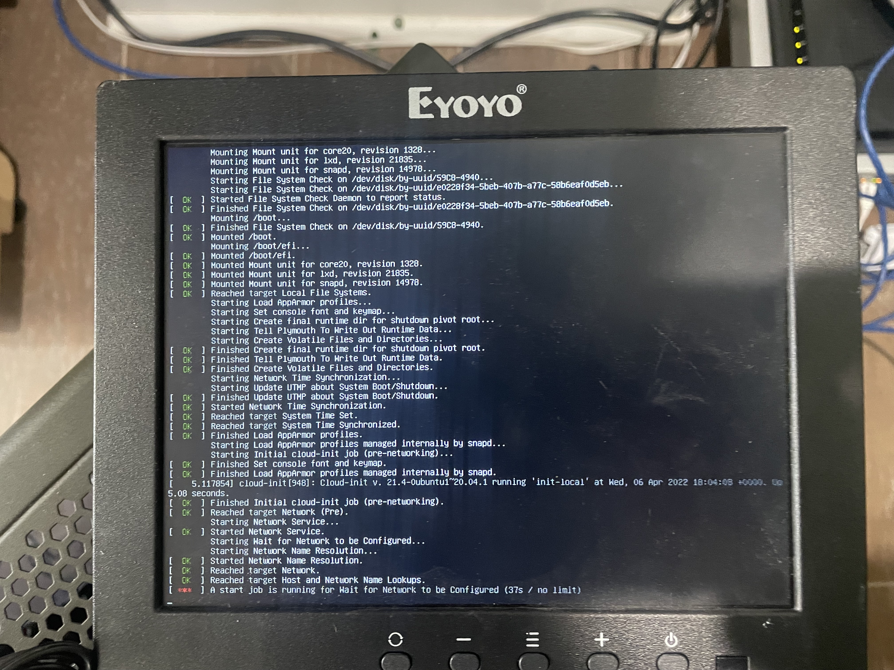

# Linux box rebuild

---
```
Language: 
Brief: 
Scope: 
Tags: 
State: 
Result: 
```
---

Rebuilding a bigboy Linux box from scratch.

### Results

---

Worked. I may hate Linux a little more.

### If I was to do more

---

### Notes

---

### Example 

---



