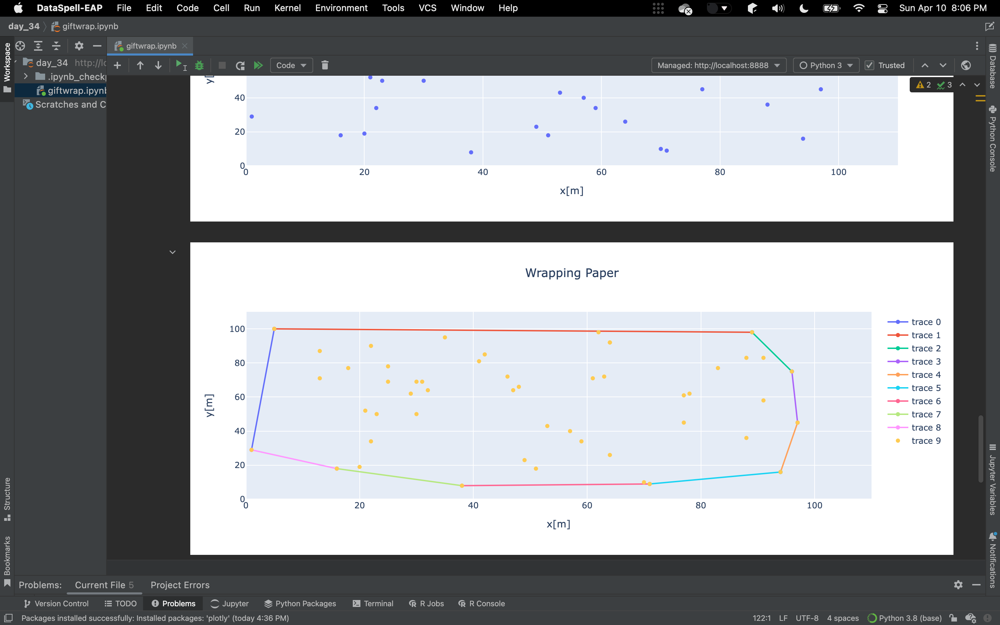

# Wrapping paper algorithm

---
```
Language: 
Brief: 
Scope: 
Tags: 
State: 
Result: 
```
---

Saw ["Wrapping paper algorithm"](https://en.wikipedia.org/wiki/Gift_wrapping_algorithm) mentioned in the GameMaker Studio marketplace. Didn't know what that was.

Also seemed like a good time to tinker with DataSpell, the Jetbrains Jupyter Notebooks IDE

### Results

---

Worked


### If I was to do more

---

Animate the search?

I think there are some corner cases that the algorithm isn't implemented correctly to handle.

### Notes

---

### Example 

---