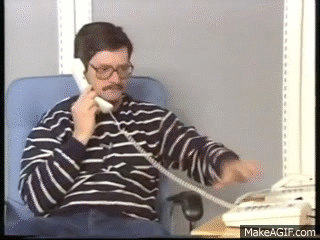

# DTMF generator
---
```
Language: Python
Brief: Create dual tone multi-frequencey tones with the same profile as US telephones
Scope: expirement
Tags: audio, phones
State: finished
Result: mostly a failure
```
---

I've never had an opportunity to use Python audio modules. DTMF is useful for a one day code project I may do later in the 100 day stretch.  



_Those who know, know_

### Results

Mostly a failure. 
The general functionality of reading keyboard buttons and playing a tone mostly works. Also multiple key presses
can be registered.

However the tones are very choppy. I think the sine waves are being clipped because I'm not calculating something 
correctly.

Example of clipping in this [screen capture quicktime](media/Screen%20Recording%202022-03-11%20at%205.55.57%20PM.mov).

Still I got to use two new modules.

### Notes

#### Clang import error
Had to specify portaudio include and lib file to get around clang error ` fatal error: 'portaudio.h' file not found
` even after using homebrew to install port audio

```
pip install --global-option='build_ext' --global-option='-I/opt/homebrew/Cellar/portaudio/19.7.0/include' --global-option='-L/opt/homebrew/Cellar/portaudio/19.7.0/lib' pyaudio`
```

#### python 'keyboard' module seg-faults on M1 chip

This is a known issue and has a thread on [the module GitHub issues page](https://github.com/boppreh/keyboard/issues/521)

```
(py3_venv) (base) [pickard@eris.local:] projects/100_days_of_code_2022/day_4 [main] ?? % python dtmf.py
zsh: segmentation fault  python dtmf.py
(py3_venv) (base) [pickard@eris.local:] projects/100_days_of_code_2022/day_4 [main] ?? % 
```

Ended up using pynput

### If I was to do more
- figure out the tone clipping. Maybe use plotlib to look at the wave?
- add a graphical UI for the dial pad
- write the full tone sequence to a WAV file