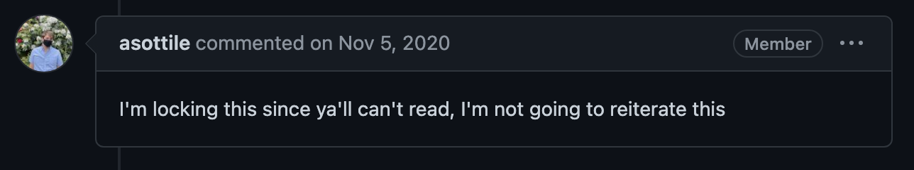

# Git Pre-commit script to create streak image
---
```
Language: Bash
Brief: Script to create media/streak.jpg automatically on commit
Scope: 
Tags: low effort
State: 
Result: 
```
---

Create a script to run the project from day_6 automatically on commit. 

Because this bash script will use the virtualenv of the 100 days project, this idea would generally be frowned upon by the folks who sheppard Git


lol.
[Activate virtualenv in hook template #1522](https://github.com/pre-commit/pre-commit/issues/1522)

But since this 100 days endeavor is just a playground for ideas, I am going to ignore that good advice.

### Results

### Notes
(NOOP to trigger commit)


### If I was to do more
